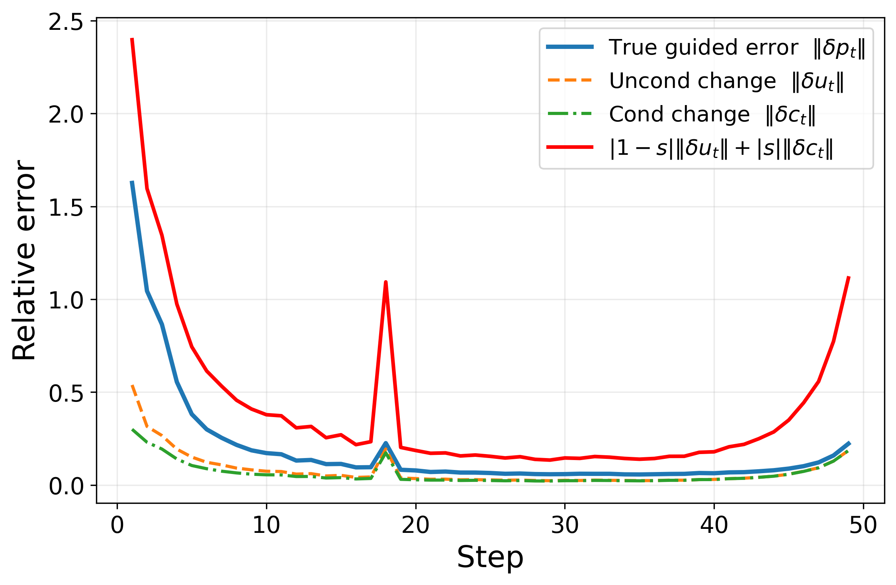
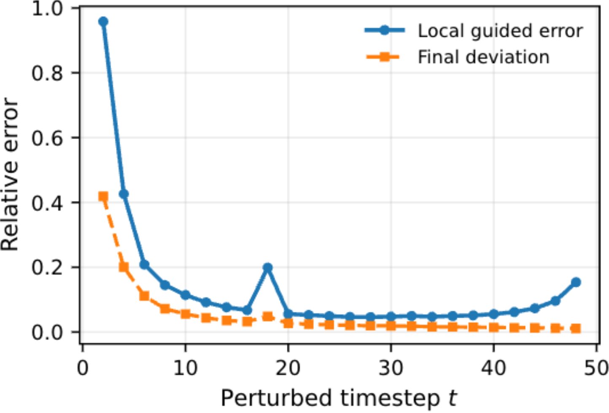
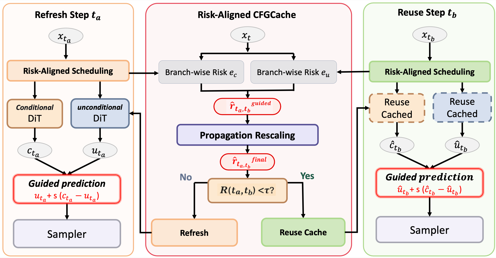

<h1 align="center">RA-CFGCache</h1>

<p align="center">
  <strong>Risk-Aligned Caching for Classifier-Free Guidance</strong><br>
  Training-free diffusion acceleration under CFG via guided-risk composition and propagation-aware rescaling.
</p>

<p align="center">
  <a href="#citation">
    
  </a>
  <a href="#license">
    
  </a>
  <a href="#installation">
    
  </a>
  <a href="#installation">
    
  </a>
</p>

---

## Overview

**RA-CFGCache** is a training-free caching framework for diffusion models under **classifier-free guidance (CFG)**.

Existing caching methods are mostly designed for standard sampling, where reuse is controlled by single-prediction or branch-wise criteria. Under CFG, however, the quantity that actually drives denoising is the **guided prediction**, not either branch alone. This creates two mismatches:

- **Branch–guided mismatch**: branch-wise reuse criteria may not reflect the true error of the guided prediction.
- **Local–final mismatch**: local guided error at one timestep does not directly determine the final output deviation, because errors propagate differently across timesteps.

RA-CFGCache addresses these two issues with:

- **CFG-aware Guided-Risk Composition**: composes branch-wise proxy risks into a guided risk aligned with the guided prediction.
- **Propagation-Aware Rescaling**: rescales the local guided risk using timestep-dependent propagation gain to better reflect final deviation.
- **Threshold-based Scheduling**: triggers refresh when the accumulated risk exceeds a threshold.

In our paper, RA-CFGCache is evaluated on **FLUX.1-dev**, **Qwen-Image**, and **CogVideoX-2B**, and achieves a stronger efficiency–fidelity trade-off than existing training-free caching baselines.

---
## Motivation
<p align="center">
  
  
</p>
Classifier-free guidance (CFG) improves conditional generation quality, but it also changes what a caching rule should care about. Existing training-free caching methods are often defined on single-prediction or branch-wise changes. Under CFG, however, the sampler is driven by the guided prediction rather than either branch alone, so small branch-wise errors do not necessarily imply a small perturbation on the actual guided update. In addition, diffusion is iterative: even when the local guided error is similar, its effect on the final sample can vary significantly depending on when the perturbation is introduced.

These two observations motivate RA-CFGCache:

- Branch–guided mismatch: branch-local reuse criteria are not aligned with the quantity that actually enters the sampler.

- Local–final mismatch: local guided error alone does not determine the final output deviation because downstream propagation is timestep-dependent.

These mismatches suggest that effective cache control under CFG should be aligned with both the guided prediction and its propagated final impact. RA-CFGCache addresses this by composing branch-wise proxy risks into a guided risk, then rescaling that risk with a timestep-dependent propagation gain before making refresh decisions.

---


## Method at a Glance

<p align="center">
  
</p>

RA-CFGCache reformulates cache control under CFG as **guided-risk control**:

1. **Compose** branch-wise proxy risks into a guided risk that matches the CFG error geometry.
2. **Rescale** the guided risk with a timestep-dependent propagation gain.
3. **Schedule** refresh/reuse decisions using a threshold on the accumulated risk.

---

## Quick Start

### 1. Create environment

```bash
cd /path/to/RA-CFGCache
bash scripts/create_env.sh
```

### 2. Run a minimal example

#### FLUX.1-dev

```bash
bash scripts/demo_flux.sh
```

#### Wan2.1-1.3B

```bash
bash scripts/demo_wan.sh
```

#### CogVideoX-2B

```bash
bash scripts/demo_cogvideox.sh
```

---

## Supported Models

| Model | Task | Status | Example Script | Notes |
|---|---|---:|---|---|
| FLUX.1-dev | Text-to-Image | ✅ | `scripts/demo_flux.sh` | Main T2I backend |
| Wan2.1-1.3B | Text-to-Video | ✅ | `scripts/demo_wan.sh` | Main T2V backend |
| CogVideoX-2B | Text-to-Video | ✅ | `scripts/demo_cogvideox.sh` | Main T2V backend |

---
## Reproduce Main Results

The main experimental configurations have already been prepared in the demo scripts under `RUN/`.

To reproduce the main results, switch to the `main` branch and run the corresponding demo script.

```bash
git checkout main
```

### FLUX.1-dev

```bash
bash RUN/demo_flux.sh
```

### Wan2.1

```bash
bash RUN/demo_wan.sh
```

### CogVideoX-2B

```bash
bash RUN/demo_cogvideox.sh
```

The only option that usually needs to be changed is the cache method:

```bash
MODE="original"
```

For baseline comparison, set `MODE` to the corresponding method, such as:

```bash
MODE="original"
MODE="TeaCache"
MODE="MagCache"
MODE="DiCache"
MODE="Taylor"
MODE="FasterCache"
MODE="CFGCache"
```

The RA-CFGCache results are obtained with:

```bash
MODE="CFGCache"
```

Then update the rho table path in the corresponding demo script:

```bash
RHO_PROXY_TABLES_PATH="./calibration/flux_rho_all_cfg.npz"
```
Make sure `RHO_PROXY_TABLES_PATH` points to the `.npz` file generated by the rho calibration stage.

## Recalibration for Custom Settings

This section is only needed if you want to reproduce the calibration process yourself, change the inference configuration, or run RA-CFGCache under a new setting.

The custom calibration pipeline contains two stages:

1. offline calibration on the `calibration` branch;
2. inference on the `main` branch.

The calibration stage estimates two types of artifacts:

- `rho`: branch-alignment statistics used by the CFG-aware risk estimator;
- `gt`: ground-truth propagation statistics used to fit the propagation-aware rescaling curve.

### 1. Offline Calibration

Switch to the calibration branch:

```bash
git checkout calibration
```

Before running calibration, make sure the calibration configuration is aligned with the inference configuration on the `main` branch. In particular, check:

- model path;
- prompt file;
- resolution;
- number of frames;
- number of denoising steps;
- CFG / guidance scale;
- scheduler and scheduler-specific parameters;
- random seed;
- prompt limit;

The calibration launch scripts are located under `RUN/`.

For FLUX:

```bash
bash RUN/run_calibration_flux.sh
```

For Wan2.1:

```bash
bash RUN/run_calibration_wan.sh
```

For CogVideoX:

```bash
bash RUN/run_calibration_cogvideox.sh
```

Each backend needs two calibration runs: one for `rho` and one for `gt`.

### 1.1 Calibrate rho

Set the calibration mode in the corresponding calibration script to `rho`.

For example:

```bash
CALIBRATE_MODE="rho"
```

Then run:

```bash
bash RUN/run_calibration_<backend>.sh
```

The raw rho calibration results will be saved under:

```text
calibration_rho/
```

After the raw calibration run finishes, update the paths in the post-processing script and run:

```bash
bash calibration_rho/calibration_rho.sh
```

This produces the final rho table, usually saved as an `.npz` file.

### 1.2 Calibrate ground-truth propagation curve

Set the calibration mode to `gt`. For the ground-truth curve, we calibrate every 3 denoising steps:

```bash
CALIBRATE_MODE="gt"
INTERVAL=3
```

Then run:

```bash
bash RUN/run_calibration_<backend>.sh
```

The raw GT calibration results will be saved under:

```text
calibration_gt/
```

After the raw GT calibration run finishes, update the paths in the post-processing script and run:

```bash
bash calibration_gt/calibration_gt.sh
```

This produces a fitted propagation curve figure. The figure also reports the fitted propagation parameters:

```text
a, b, alpha
```

These values should be copied into the RA-CFGCache configuration used during inference.

### 2. Inference with Custom Calibration

After calibration, switch back to the main branch:

```bash
git checkout main
```

Then configure the corresponding demo script:

```text
RUN/demo_flux.sh
RUN/demo_wan.sh
RUN/demo_cogvideox.sh
```

Set the cache method to RA-CFGCache:

```bash
MODE="CFGCache"
```

Update the rho table path in the demo script so that it points to the `.npz` file produced by rho calibration:

```bash
RHO_PROXY_TABLES_PATH="/path/to/calibration_rho/<backend>/rho_table.npz"
```

The propagation-aware rescaling parameters should be updated in `cache_init.py` according to the fitted GT curve:

```python
prop_a = ...
prop_b = ...
prop_alpha = ...
```

The cache threshold should also be configured in `cache_init.py` according to the desired speed-quality trade-off.

Finally, run the corresponding demo script:

```bash
bash RUN/demo_flux.sh
```

or:

```bash
bash RUN/demo_wan.sh
```

or:

```bash
bash RUN/demo_cogvideox.sh
```

### Notes

- The released main results can be reproduced directly with `RUN/demo_flux.sh`, `RUN/demo_wan.sh`, and `RUN/demo_cogvideox.sh`.
- Custom calibration is only required when the model, resolution, scheduler, number of steps, CFG scale, prompt set, or other key settings are changed.
- The calibration configuration and inference configuration must be aligned. Otherwise, the calibrated rho table and propagation parameters may not match the actual inference setting.
- `rho` calibration produces the rho table used by RA-CFGCache.
- `gt` calibration produces the fitted propagation curve and the parameters `a`, `b`, and `alpha`.
- The GT calibration interval is set to `3` by default, meaning one calibration point is collected every 3 denoising steps.
- Currently, the cache threshold and propagation-aware parameters are configured in `cache_init.py`. They should be kept consistent with the fitted calibration results.

## Results

### Main Results

We evaluate RA-CFGCache on both text-to-image and text-to-video generation. All metrics are computed against the full-step vanilla baseline under the same prompt set and random seed.

| Model | Task / Setting | Method | Speedup ↑ | Latency (s) ↓ | LPIPS ↓ | SSIM ↑ | PSNR ↑ |
|---|---|---|---:|---:|---:|---:|---:|
| FLUX.1-dev | Text-to-Image, 1024×1024, CFG=3.5 | RA-CFGCache-Slow (τ=0.18) | 3.19× | 6.58 | **0.1137** | **0.8680** | **24.02** |
| FLUX.1-dev | Text-to-Image, 1024×1024, CFG=3.5 | RA-CFGCache-Fast (τ=0.3) | **3.95×** | **5.32** | 0.1484 | 0.8340 | 22.75 |
| Wan2.1-1.3B | Text-to-Video, 81 frames, 480P, CFG=5.0 | RA-CFGCache-Slow (τ=0.4) | 2.56× | 36.48 | **0.0993** | **0.8778** | **28.03** |
| Wan2.1-1.3B | Text-to-Video, 81 frames, 480P, CFG=5.0 | RA-CFGCache-Fast (τ=0.6) | **2.99×** | **31.25** | 0.1409 | 0.8386 | 26.12 |
| CogVideoX-2B | Text-to-Video, 49 frames, 480P, CFG=6.0 | RA-CFGCache-Slow (τ=0.6) | 2.39× | 16.96 | **0.0968** | **0.8746** | **26.93** |
| CogVideoX-2B | Text-to-Video, 49 frames, 480P, CFG=6.0 | RA-CFGCache-Fast (τ=1.4) | **3.13×** | **12.91** | 0.2052 | 0.7614 | 21.89 |

### Trade-off Curve

<p align="center">
  
</p>

### Qualitative Examples

<p align="center">
  
</p>


---

## Limitations

RA-CFGCache is effective in practice, but several limitations remain:

- The propagation gain is a first-order approximation of downstream error propagation.
- The scheduler is an online threshold-based controller rather than a globally optimal sequential policy.
- The framework is most naturally compatible with proxy families that have explicit cumulative reuse semantics.

---
## Citation

If you find this repository useful, please consider citing our work:

```bibtex
@article{ra_cfgcache_2026,
  title={RA-CFGCache: From Branch-Level Heuristics to Guided-Risk Control under Classifier-Free Guidance},
  author={Anonymous Authors},
  journal={arXiv preprint arXiv:xxxx.xxxxx},
  year={2026}
}
```

---

## Acknowledgement

This repository is initialized from [HiCache](https://github.com/fenglang918/HiCache). We sincerely thank the HiCache authors for releasing their codebase, which provides an important foundation for this project.

We also thank the authors of prior training-free diffusion acceleration and caching methods, including TeaCache, MagCache, DiCache, FasterCache, and TaylorSeer, for their inspiring works and open-source contributions.

## Contact

For questions, bug reports, or collaboration, please open an issue or contact:

- Yiming Liu: `liuyiming5117@163.com`

